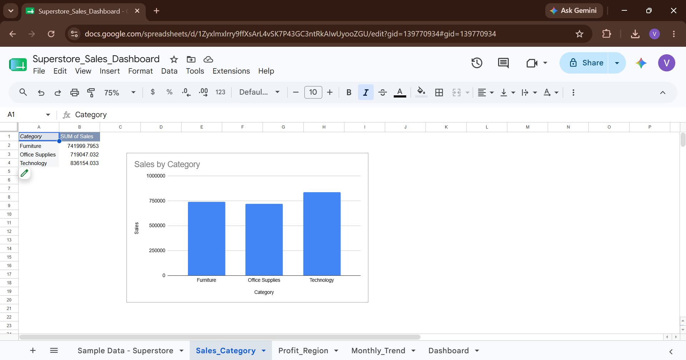
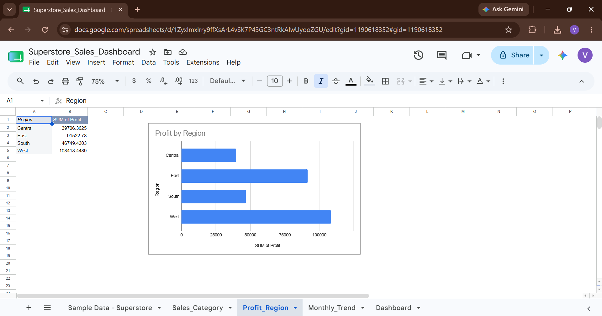
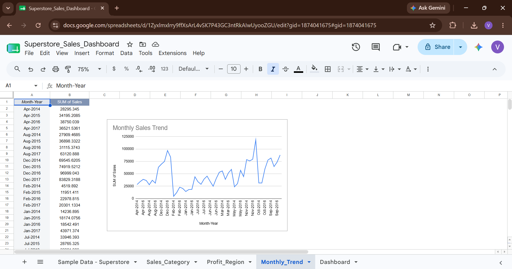

# Superstore Sales Dashboard (Google Sheets)

## Project Overview
This project analyzes Superstore sales data using Google Sheets to identify trends in sales, profit, categories, and regions.

## Tools Used
- Google Sheets
- Excel (for dataset handling)

## Key Metrics
- Total Sales: ₹22.97L
- Total Profit: ₹2.86L
- Total Orders: 9,994

## Analysis Process
- Data cleaning and formatting
- Pivot tables for aggregation
- Charts for visualization (sales, profit, trends)
- KPI summary dashboard creation

## Key Insights
- Technology category generated the highest sales, indicating strong demand for high-value products.
- West region generated the highest profit, while Central region underperformed significantly.
- Sales show strong seasonal spikes in November and December.
- Overall performance is uneven across regions, indicating dependency on top-performing areas.
- 

### Sales Overview

### Profit Analysis

### Monthly Trend

## Dashboard Preview
[Superstore_Sales_Dashboard.xlsx](https://github.com/user-attachments/files/29330775/Superstore_Sales_Dashboard.xlsx)

## Conclusion
This analysis highlights that sales and profit are not evenly distributed across regions and categories. The West region is the strongest contributor to profit, while the Central region shows consistent underperformance, indicating potential operational inefficiencies.

Seasonal trends show peak sales during year-end months, suggesting strong seasonal demand patterns. Additionally, certain categories generate high sales but do not necessarily translate into proportional profit, indicating the importance of profitability-focused decision-making rather than relying on revenue alone.

